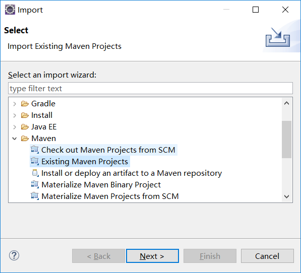
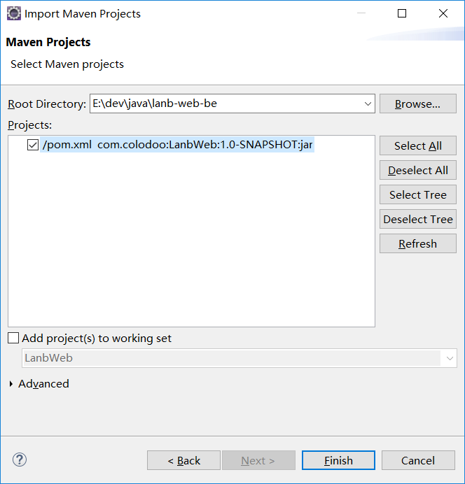
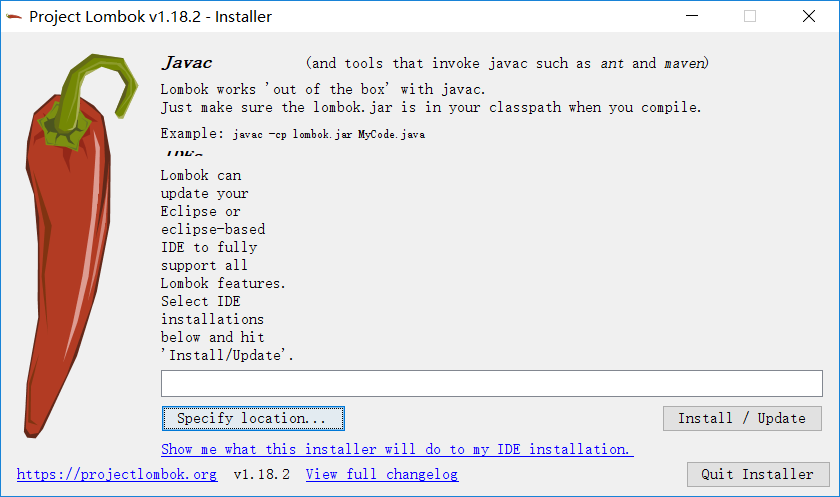
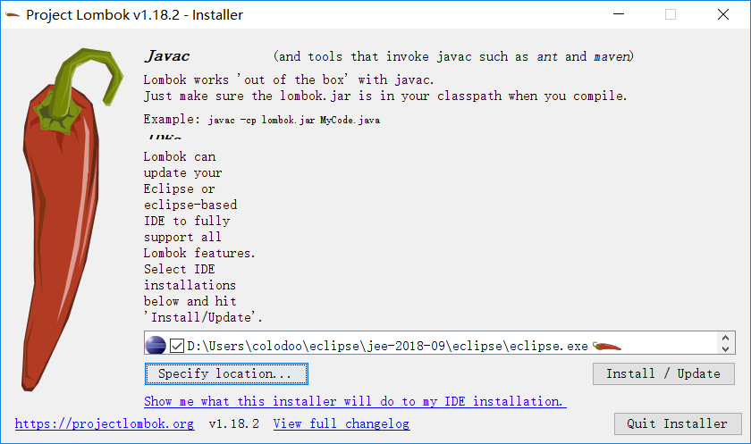

# windows部署指南  

## 下载
```bash
git clone git@github.com:colodoo/lanb-web-be.git
```

## 导入

### 导入到Eclipse

选择按maven方式导入  
  
  

选中该项目目录  
  
  

### 导入到IDEA
  
File -> Open -> 用项目方式打开pom.xml

## 安装lombok插件

把lib目录中的lombok.jar放到eclipse安装目录中，然后在当前目录运行该文件。


```bash
java -jar lombok.jar
```

 

如果是解压包方式安装的，可能需要重新选中当前eclipse安装目录。  
    
 

## redis

因为在该版本引入了redis作为seession的容器，所以在启动项目前需要启动redis。  
  
redis版本不能过低，至少>= 3.2.100  

```bash
redis-server.exe redis.windows.conf
```

启动redis即可
  
## 启动

直接以正常Java项目的形式运行Application.java文件。

